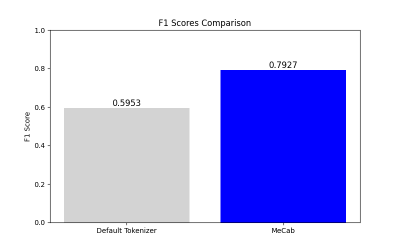
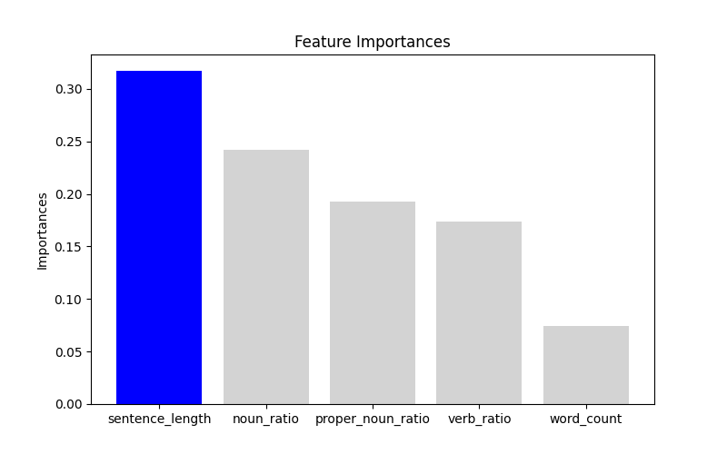
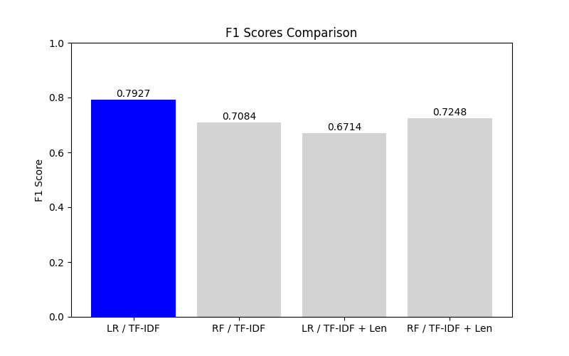
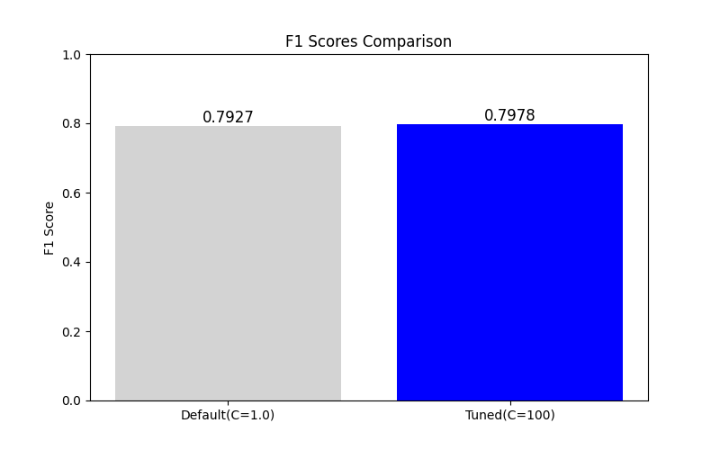

# ニュース記事分類プロジェクト

## 概要
本プロジェクトの目的は、Livedoorニュース記事をカテゴリに応じて自動分類する機械学習モデルを構築することです。小規模データに対する実験から手法を検討し、最終的精度と計算コストのバランスが良いモデルを構築しました。

### 環境
- **環境**: Windows11
- **言語**: Python 3.10.5
- **主要ライブラリ**: `scikit-learn`, `MeCab`, `PySpark`, `Transformers(BERT)` 

### フォルダ構成
```
.
├── experiment/ ................. 小規模データでの実験
│   ├── results ................. 結果のグラフを格納したフォルダ
│   ├── config.py ............... 実験の設定ファイル
│   ├── feature_experiment.py ... TF-IDF以外の特徴量を評価
│   ├── model_experiment.py  .... ロジスティック回帰とランダムフォレストを比較
│   ├── tfidf_experiment.py ..... TF-IDFのトークナイザーの影響を確認
│   └── tuning_experiment.py .... ロジスティック回帰の正則化パラメータのチューニング     
├── README.md
├── news_data.csv ............... ニュースデータ
├── bert.py ..................... BERTによるカテゴリ予測
└── spark_logistc.py ............ 実験結果をもとに作成したメインモデル
```

### データ (`news_data.csv`)
データは[こちら](https://www.rondhuit.com/download.html)より引用したLivedoorニュース記事(7376件)を使用しました。ここではテキスト (`sentence`) とカテゴリラベル (`label`)のみを抽出したデータを用います。カテゴリラベルは0~8の9つあります。 

| label | sentence |
|-------|--------------------------------------------------------------|
| 1     | やっぱいいわ！レッツノート！  SX2の中身はコレだ！最強モバイルノートPC開封フォトレポ |
| 2     | 元日本代表・本田泰人、テレビ番組で衝撃の告白 |
| 7     | ソニーモバイル、Xperia GXおよびXperia SXを東京・名古屋・大阪にて6月20日から先行展示開始 |
...

## 実験の流れ (Experimental Steps)
### 1. MeCab の有無を比較
- デフォルトTF-IDF: `F1=0.59`
- **MeCab TF-IDF**: `F1=0.79`
- **結論**: MeCabを使うと分類精度が大きく向上



### 2. センテンス長を特徴量に追加
- **目的**: 記事の種類によって文章の長さが異なるため、分類の精度向上を期待
- **結果**:
  - `F1スコア`: TF-IDFのみ (0.79) → TF-IDF + センテンス長 (0.67)
  - **考察**: 線形モデル (ロジスティック回帰) ではセンテンス長がノイズになり、精度が低下



### 3. ロジスティック回帰のハイパーパラメータ調整 (C=100)


### 4. ロジスティック回帰のハイパーパラメータ調整 (C=100)
- GridSearchCV を用いた最適化
- `F1スコア`: C=1 (0.79) → C=100 (0.80)
- **結論**: わずかに向上するが、極端な改善は見られない



### 4. Spark を用いた大規模データ対応
- **目的**: 分散環境での大規模データ処理の実験
- **結果**: ローカル環境では効果は限定的だったが、将来的に大規模データ対応可能な基盤を構築

### 5. BERT ファインチューニングによる比較
- `F1スコア`: 0.85 (BERT) 
- **考察**: 精度向上は見られるが、学習・推論コストが大幅に増大
- **結論**: 高速推論が求められる環境では TF-IDF + LR の方が運用しやすい


## 結果・考察・今後の展望
- **最適なモデル**: TF-IDF + ロジスティック回帰 (C=100)
- **BERTの適用可能性**: 高精度だが計算コストが大きい
- **今後の課題**:
  - LLMのembeddingを活用した特徴量生成
  - ストップワード・特殊記号の影響調査
  - GPU環境でのBERTや他の深層学習モデルとの比較

## ライセンス (License)
- 本リポジトリのソースコードはMITライセンス等、社内規定に応じてご自由にご利用ください。
- Livedoorニュースのデータセットに関しては、各配信元の利用規約をご確認ください。

